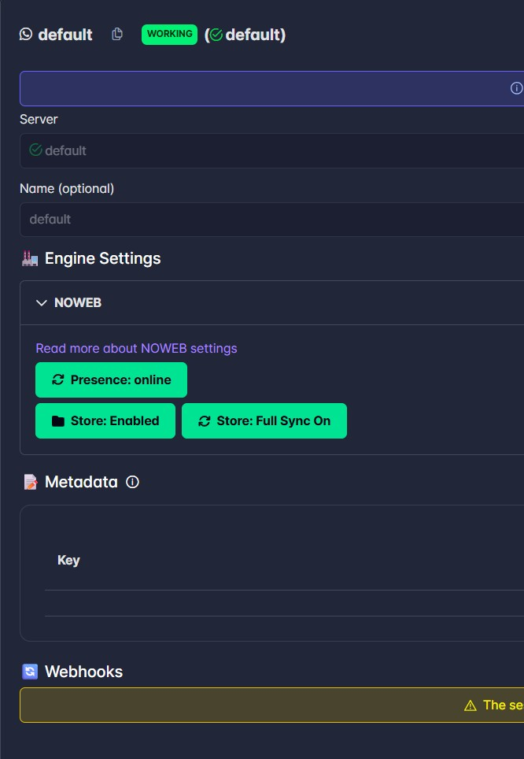
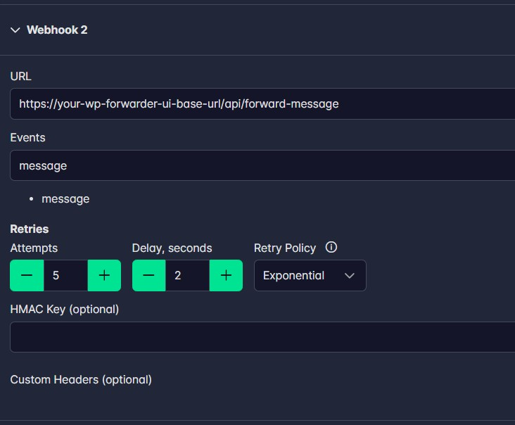
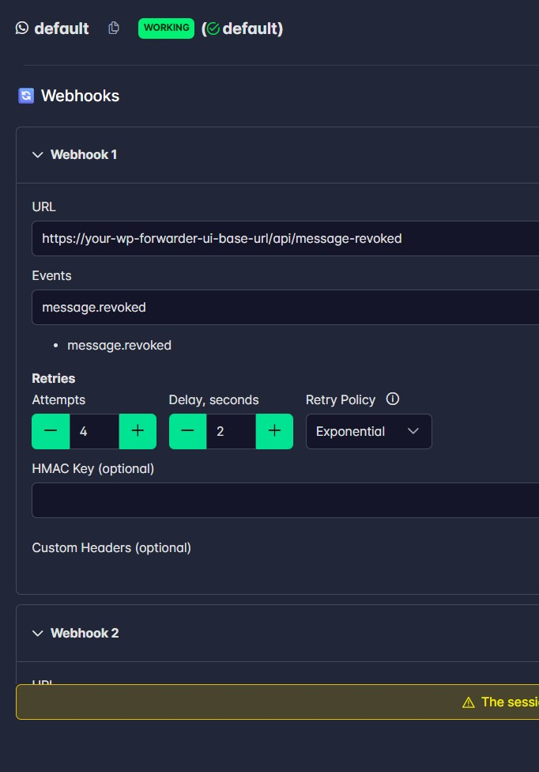

# Whatsapp Forwarder

This application is designed to help you set up and manage message forwarding between different chat groups seamlessly. It provides an intuitive and responsive interface that adapts to both light and dark modes, ensuring a consistent experience across devices and environments.


## Features

- **Comprehensive Message Forwarding:**  
  Easily configure and manage forwarding rules between different chat groups to streamline communication.

- **Advanced Filtering Options:**  
  - **Word Filters:** Forward messages that contain specific keywords.
  - **Regex Filtering:** Use custom regular expressions to match complex message patterns.
  - **Price Adjustment: (Optional)** Modify numeric values within messages to reflect price changes. (we use an AI agent to increase the price (for a specific use case) inside the message.)
  - **Additional Processing:** Choose to ignore messages that include links, phone numbers, or specific media MIME types.

- **User-Friendly Setup:**  
  Set up forwarding rules quickly using a guided interface with searchable dropdown menus.

- **Responsive & Themed UI:**  
  Enjoy a modern, responsive design that automatically adjusts for both light and dark themes, ensuring an optimal experience on any device.

- **Effortless Management:**  
  Easily view, edit, and delete your forwarding configurations through a clear and organized dashboard.


## Prerequisites

- **Node.js** (v16 or higher)
- **npm** (comes with Node.js)
- **WAHA Server** - WhatsApp HTTP API server (required for WhatsApp connectivity)

## Setup Instructions

### Step 1: Setup WAHA Server

**Connecting with the WAHA server is necessary** to enable WhatsApp message forwarding. WAHA (WhatsApp HTTP API) acts as the bridge between this application and WhatsApp.

1. Visit the official WAHA documentation: [https://waha.devlike.pro/](https://waha.devlike.pro/) (No Subscription Required for forwarding.)
2. Follow the WAHA setup guide to deploy your own WAHA server
3. Once your WAHA server is running, note down:
   - **WAHA Server URL** (e.g., `http://localhost:3000` or your hosted URL)
   - **API Key** (if you configured one)

### Step 2: Create Session on WAHA

Before setting up this application, you need to create a WhatsApp session on WAHA:

1. Access your WAHA server interface
2. **Create a new session** with a unique session name (e.g., `default`)

3. **Setup two webhooks** in WAHA for this session:
   - **Webhook 1 (Forward Messages):** Configure this webhook to point to your WhatsAppForwarder instance
   
   - **Webhook 2 (Revoke/Delete Messages):** Configure this webhook to handle message deletions and revocations
   
4. Skip the QR scanning page as this is not yet functional.

### Step 3: Install WhatsApp Forwarder

1. **Clone the repository:**
   ```bash
   git clone <repository-url>
   cd WhatsappForwarder
   ```

2. **Install dependencies:**
   ```bash
   npm install
   ```

3. **(Optional) Configure environment variables:**
   Create a `.env` file in the root directory if you need to configure any environment-specific settings:
   ```env
   NODE_ENV=development
   ```

### Step 4: Run the Application

**For Development:**
```bash
npm run dev
```
This command will start both the frontend (Vite) and backend (Express API server) concurrently.
- Frontend will be available at: `http://localhost:5173`
- Backend API will run on: `http://localhost:3005`

**For Production:**
```bash
# Build the application
npm run build

# Start the production server
npm start
```

### Step 5: Create Session in WhatsApp Forwarder

1. Open the application in your browser (`http://localhost:5173` in development)
2. Navigate to the **Create Session** page
3. Fill in the following details:
   - **Session Name:** Enter the **same session name** you created in WAHA UI (e.g., `my-whatsapp-session`)
   - **WAHA Server API URL:** Enter the URL where your WAHA server is hosted (e.g., `http://localhost:3000`)
   - **API Key:** Enter your WAHA API key (if configured)
   - **Description:** (Optional) Add a description for your reference
4. Click **Create Session**

### Step 6: Setup Forwarding Rules

1. Navigate to the **Setup Forwarding** page
2. **Select Source Chat:** Choose the WhatsApp chat/group from which messages should be forwarded
3. **Select Destination Chat:** Choose the WhatsApp chat/group where messages should be forwarded to
4. **Configure Filters (Optional):**
   - Add word filters to forward only messages containing specific keywords
   - Use regex patterns for advanced filtering
   - Configure price adjustments if needed (if you do not want price updates, leave it empty or enter 0)
   - Set options to ignore links, phone numbers, or specific media types
5. Click **Add Mapping** to save your forwarding rule
6. Repeat for additional forwarding rules as needed

### Step 7: Start Forwarding

Once all mappings are configured, the application will automatically:
- Monitor incoming messages from source chats
- Apply configured filters
- Forward matching messages to destination chats
- Handle message revocations/deletions

## Managing Your Forwarding Rules

Access the **Dashboard** to:
- View all active forwarding mappings
- Edit existing configurations
- Delete mappings you no longer need
- Monitor forwarding activity

## Troubleshooting

- **Cannot connect to WAHA:** Ensure your WAHA server is running and accessible at the URL you provided
- **Messages not forwarding:** Verify that:
  - Webhooks are correctly configured in WAHA
  - Session is active and authenticated
  - Filters are not blocking messages unintentionally
- **API errors:** Check that the API key is correct and the session name matches exactly

## Technology Stack

- **Frontend:** React, TypeScript, Vite, TailwindCSS
- **Backend:** Node.js, Express
- **WhatsApp Integration:** WAHA (WhatsApp HTTP API)

## Getting Started

You can use this Message Forwarder for your use case to enhance your communication system. Its powerful filtering and forwarding capabilities help you manage message flow and maintain consistency across your chat groups with minimal effort.

## Contributing & Questions

We welcome contributions and feedback from the community!

- **Report Issues:** Found a bug or have a problem? Please report it on our issues page
- **Contribute:** Want to improve the project? Feel free to contribute with pull requests
- **Ask Questions:** Have questions or need clarification? Don't hesitate to raise them in the issues or discussions

---

If you need any help, please contact:  
**contact@changeblogger.org**

## Support us ☕

If you find this project useful, consider buying me a coffee — it helps cover hosting and development time and motivates continued improvements.

[](https://www.buymeacoffee.com/changeblogger.org)  
Or visit: https://www.buymeacoffee.com/changeblogger.org

\#WhatsappAutoForwarder
\#WhatsappForwarding
\#WhatsappForwardingAuto